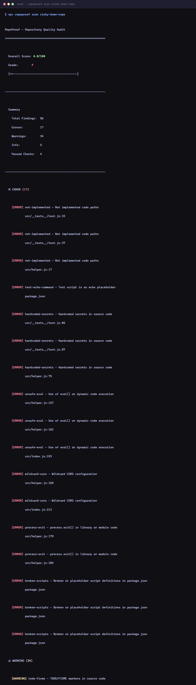

<h1 align="center">RepoProof</h1>

<p align="center">
  <b>Deterministic, local-first CLI that audits repository-quality risks<br>
  in AI-generated and rapidly built software projects.</b>
</p>

<p align="center">
  <a href="https://github.com/MadB0i/RepoProof/actions/workflows/ci.yml"></a>
  <a href="https://www.npmjs.com/package/repoproof"></a>
  <a href="LICENSE"></a>
  
  
</p>

---

## RepoProof audits itself

RepoProof's CI-controlled self-audit scores **90/A with zero errors**:

<p align="center">
  
</p>

---

## See it catch a deliberately broken repository

Scanning a repository that is intentionally insecure and incomplete — 56 findings detected in under a second:

<p align="center">
  
</p>

This repository is intentionally insecure and incomplete. Its low score demonstrates RepoProof's detection capabilities — not RepoProof's own quality.

<p align="center">
  
</p>

---

## Why RepoProof

AI coding assistants generate code faster than ever, but they also introduce systematic patterns that degrade repository quality: stub implementations, hardcoded secrets, disabled tests, empty catch blocks, commented-out code, missing documentation, and insecure configurations.

Manually reviewing for these patterns is tedious and inconsistent. RepoProof makes it deterministic and repeatable — scanning a full repository in under a second with zero external dependencies.

---

## Features

- **31 deterministic rules** — covers incomplete implementations, test gaps, security configuration, error-handling reliability, and repository readiness
- **100% local** — all analysis runs on your machine. No data leaves your network
- **No AI API key** — pure static analysis, no prompts, no cloud calls
- **Does not execute your code** — source text is parsed, scripts are never run
- **No telemetry** — zero data collection, zero tracking, no analytics
- **Multiple report formats** — text, JSON, Markdown, HTML, SARIF
- **CI-native** — single CLI command with `--min-score` and `--fail-on` gates
- **Fast** — scans tens of thousands of files in under a second
- **Node 20, 22, 24** — verified on every CI run
- **245 tests** — full regression suite passes before every release

---

## Installation

```bash
# Install globally
npm install -g repoproof

# Or run without installation
npx repoproof scan .
```

---

## Quick Start

```bash
# Scan the current directory
npx repoproof scan .

# Scan a specific project
npx repoproof scan ./path/to/project

# Generate an HTML report
npx repoproof scan . --format html --output report.html

# Generate a SARIF report for GitHub Code Scanning
npx repoproof scan . --format sarif --output results.sarif

# Explain a specific rule
npx repoproof explain hardcoded-secrets

# List all available rules
npx repoproof list-rules

# Initialize a configuration file
npx repoproof init
```

---

## Example Findings

```javascript
// ❌ not-implemented: Code path not implemented
function processData() {
  throw new Error("not implemented");
}

// ❌ empty-function: Empty function body
function handleClick() {}

// ❌ hardcoded-secrets: API key in source
const apiKey = "YOUR_API_KEY_HERE"; // [REDACTED]

// ❌ empty-catch: Silently swallowed error
try {
  await fetch("/api/data", { signal: AbortSignal.timeout(5000) });
} catch (e) {} // empty catch
```

---

## Report Formats

| Format   | Command                   | Use Case                 |
| -------- | ------------------------- | ------------------------ |
| Text     | `--format text` (default) | Terminal output          |
| JSON     | `--format json`           | Programmatic consumption |
| Markdown | `--format markdown`       | PR comments, issues      |
| HTML     | `--format html`           | Visual browsing, sharing |
| SARIF    | `--format sarif`          | GitHub Code Scanning     |

---

## Configuration

Create a `.repoproof.json` or `.repoproof.jsonc` file in your project root:

```jsonc
{
  "$schema": "https://raw.githubusercontent.com/MadB0i/RepoProof/main/schema.json",
  "minScore": 75,
  "failOn": "warning",
  "disabledRules": ["mock-data"],
  "severityOverrides": {
    "empty-function": "error",
  },
  "penaltyOverrides": {
    "empty-function": 1,
  },
  "excludedPaths": ["dist", "generated"],
}
```

---

## GitHub Actions

```yaml
- name: Scan with RepoProof
  run: npx repoproof scan . --format sarif --output results.sarif --min-score 90 --fail-on error

- name: Upload SARIF to GitHub
  uses: github/codeql-action/upload-sarif@v3
  with:
    sarif_file: results.sarif
```

---

## Supported Languages

RepoProof detects and scans projects written in:

- **JavaScript** (`.js`, `.jsx`, `.mjs`, `.cjs`)
- **TypeScript** (`.ts`, `.tsx`, `.mts`, `.cts`)
- **Python** (`.py`)
- **Rust** (`.rs`)
- **Go** (`.go`)
- **Java** (`.java`)
- **Ruby** (`.rb`)
- **PHP** (`.php`)
- **C#** (`.cs`)
- **Kotlin** (`.kt`)
- **Swift** (`.swift`)
- **Shell** (`.sh`, `.bash`, `.zsh`)

---

## Safety and Privacy

- **No data exfiltration.** All scanning is performed locally. RepoProof never sends source code, file contents, or findings to any remote service.
- **No AI API key needed.** There is no AI component. Every rule is deterministic pattern matching.
- **No telemetry.** The CLI contains zero analytics, tracking, or usage reporting.
- **Does not execute scripts.** RepoProof parses source files as text only. It never runs `npm install`, `pip install`, `make`, or any build command found in the repository.
- **Secret redaction.** When secrets are detected, the matching values are redacted in all report outputs with `[REDACTED]`.

---

## Limitations

- RepoProof is a **static analysis tool**. It cannot prove whether code was written by AI or by a human.
- It is not a **security certification**. It flags patterns that are commonly associated with risk, but passing a scan does not guarantee a secure or production-ready repository.
- Rules are intentionally conservative to minimise false positives. Some issues may require manual review.
- Language support is file-extension based. RepoProof does not parse or understand language semantics — it scans source text for patterns.

---

## Rules Overview

| Category                         | Rule IDs                                                                                                                                                                                        | What It Detects                                                     |
| -------------------------------- | ----------------------------------------------------------------------------------------------------------------------------------------------------------------------------------------------- | ------------------------------------------------------------------- |
| **Incomplete Implementation**    | stubs, dead code, work-in-progress markers, mock data, coverage gaps                                                                                                                            | Stubs, dead code, TODO markers, mock data                           |
| **Tests**                        | `disabled-tests`, `empty-test-files`, `missing-tests`                                                                                                                                           | Skipped tests, empty test bodies, files without corresponding tests |
| **Security Configuration**       | `hardcoded-secrets`, `unsafe-eval`, `wildcard-cors`, `debug-enabled`, `env-tracked`, `env-documented`, `broken-scripts`                                                                         | Secrets, eval, CORS misconfiguration, debug modes left enabled      |
| **Error Handling & Reliability** | `empty-catch`, `no-http-timeout`, `unbounded-retries`, `process-exit`                                                                                                                           | Silent error swallowing, hanging HTTP requests, infinite retries    |
| **Repository Readiness**         | `readme-exists`, `license-exists`, `contributing-exists`, `code-of-conduct`, `changelog-exists`, `ci-workflow`, `missing-gitignore`, `lockfile-exists`, `package-metadata`, `test-echo-command` | Missing project files, metadata, lockfiles, CI configuration        |

---

## Contributing

Contributions are welcome. Please see [CONTRIBUTING.md](CONTRIBUTING.md) for guidelines.

---

## License

[MIT](LICENSE)
