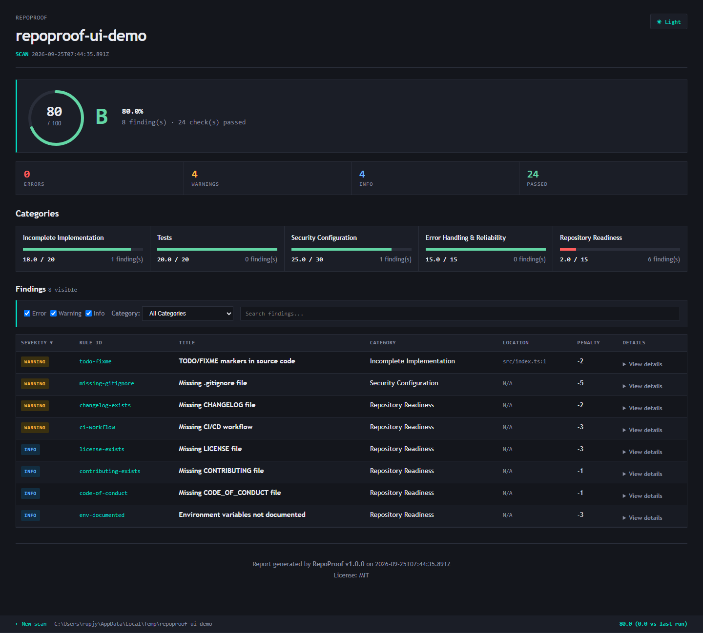
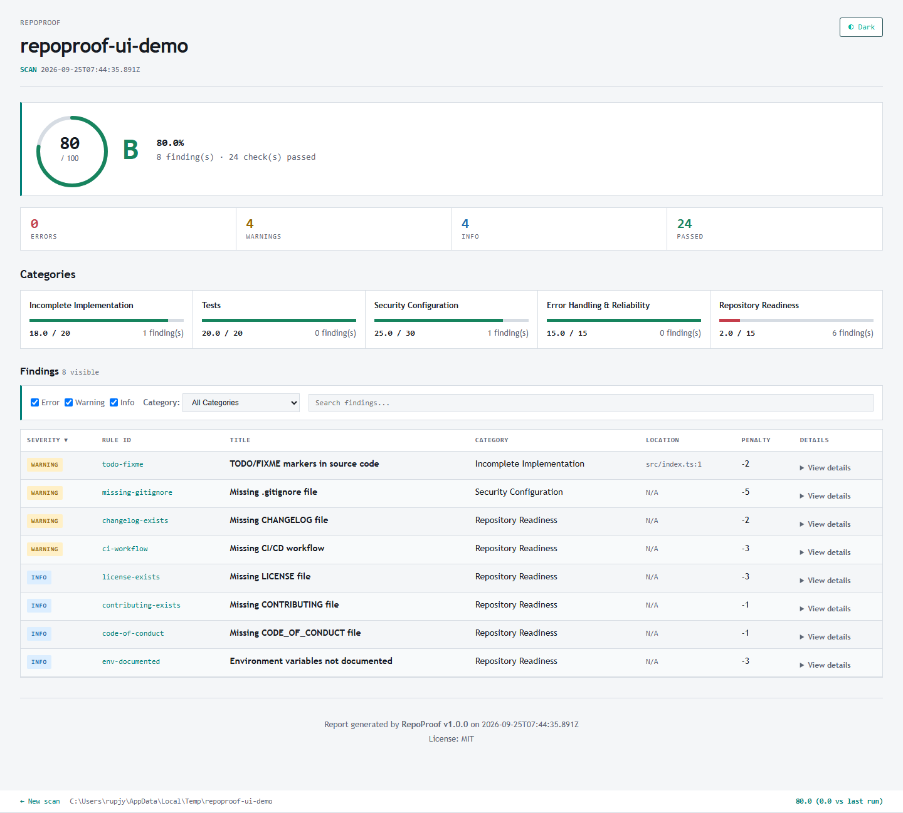
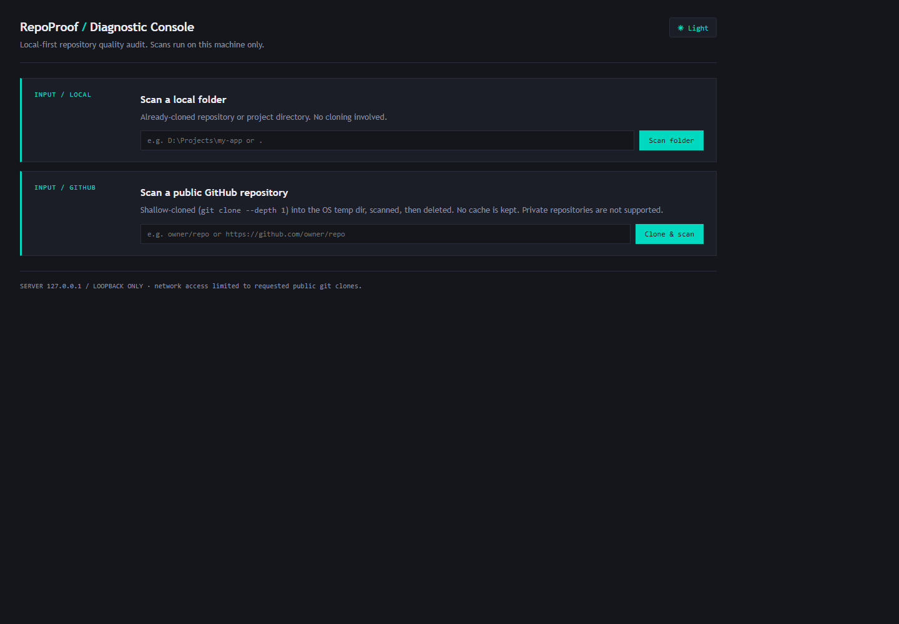

<div align="center">

# RepoProof

**Deterministic, local-first repository quality auditing for AI-generated and rapidly built software.**

[](https://github.com/MadB0i/RepoProof/actions/workflows/ci.yml)
[](https://www.npmjs.com/package/repoproof)
[](LICENSE)
[](https://nodejs.org/)

</div>

RepoProof finds repository-quality and security risks with deterministic static rules: unfinished implementations, exposed secrets, disabled tests, unsafe command execution, weak error handling, and missing release-readiness files. It does not execute the project being scanned.

## See the report



The report puts the score, grade, target, timestamp, category breakdown, and actionable findings in one local HTML file. Light mode is available from the same report:



## Install

Requires Node.js 20, 22, or 24.

```bash
npm install -g repoproof
```

Or run without installing:

```bash
npx repoproof scan .
```

## Quick start

```bash
# Audit the current directory
npx repoproof scan .

# Audit a specific local project
npx repoproof scan ./path/to/project

# Generate a shareable HTML report
npx repoproof scan . --format html --output report.html

# Start the local web dashboard
npx repoproof serve
```

A verified run against the included `src/good-fixture` produced:

```text
★ 93.0/100  (Grade A)
Total Findings:  2
Errors:          0
Warnings:        2
Info:            0
Passed Checks:   30
```

The complete report is written to the terminal; use `--format json`, `--format markdown`, or `--format sarif` when another format is more useful.

## Web UI

```bash
npx repoproof serve                 # http://127.0.0.1:4321
npx repoproof serve --port 8080     # custom port
```

The dashboard has two inputs:

- **Local folder** — scan an already-cloned project without uploading it.
- **Public GitHub repository** — shallow-clone `owner/repo` with `git clone --depth 1`, scan it, then delete the temporary clone. Private repositories are not supported.



The server binds to `127.0.0.1` only. A scan is local by default; the only requested network operation is the explicit public GitHub clone. Invalid paths and clone failures are shown in the dashboard without stopping the server.

## Features

- **32 deterministic rules across 5 categories** — incomplete implementation, tests, security configuration, error handling/reliability, and repository readiness. See [all rules](docs/rules.md).
- **Configuration discovery** — `.repoproof.json`, `.repoproof.jsonc`, `repoproof.config.json`, `.repoproofrc.json`, and `.repoproofrc` are auto-discovered. See [configuration](docs/configuration.md).
- **`.repoproofignore`** — gitignore-style path and glob exclusions that merge additively with config exclusions.
- **Score history** — `.repoproof/history.json` keeps the last 50 runs; the previous score becomes the next run's automatic baseline. Use `--baseline-score` to override it or `--no-history` to disable history.
- **Five output formats** — text, JSON, Markdown, HTML, and SARIF.
- **CI gates** — use `--min-score` and `--fail-on error|warning` in CI.
- **Local static analysis** — no AI model, prompts, or API key; scanned project code is read as text and not executed.
- **No telemetry** — scans do not send source or findings to a service.
- **Web dashboard** — scan local folders and public GitHub repositories from a loopback-only local server.
- **Node 20/22/24 CI matrix** and typecheck, lint, format, test, build, smoke, and self-audit checks.

## Why RepoProof?

Generic linters are valuable, but they do not target the failure patterns that show up when software is generated quickly: stubs left behind, tests that look present but do nothing, secrets in examples, placeholder scripts, missing project metadata, and security configuration that is technically present but unsafe. RepoProof turns those patterns into a deterministic, repeatable score with a human-readable remediation for each finding.

It is a focused risk scanner, not a replacement for compiler diagnostics, a full SAST platform, or a security certification. See [limitations](#limitations).

## Reports

| Format | Command | Typical use |
| --- | --- | --- |
| Text | `--format text` | Terminal and CI logs |
| JSON | `--format json` | Programmatic consumption |
| Markdown | `--format markdown` | Pull requests and issues |
| HTML | `--format html` | Local review and sharing |
| SARIF | `--format sarif` | GitHub code scanning |

For a GitHub Actions SARIF workflow, see [report formats](docs/report-formats.md).

## Configuration

Start with a small project config:

```jsonc
{
  "minScore": 75,
  "failOn": "warning",
  "excludedPaths": ["dist", "generated"],
  "severityOverrides": {
    "empty-function": "error"
  },
  "penaltyOverrides": {
    "empty-function": 1
  }
}
```

Config priority is explicit `--config <path>` first, then auto-discovery, then defaults. See the full [configuration guide](docs/configuration.md) for schema, ignore files, history, and CLI overrides.

## Safety and privacy

- Scans are local and do not upload source files, file contents, or findings.
- The scanner does not run project scripts, package-manager scripts, build commands, or Git hooks from the scanned repository.
- Secret findings redact matched values with `[REDACTED]` in the supported report outputs.
- The web server binds only to `127.0.0.1`; GitHub cloning happens only when explicitly requested.
- The `github` metadata command is a separate, explicit read-only GitHub API operation. The web GitHub scan uses a temporary shallow clone.

## Limitations

- RepoProof cannot determine whether code was written by AI or by a human.
- A passing score is not a guarantee of security, correctness, or production readiness.
- Rules are deliberately conservative, but pattern matching can still produce false positives and can miss semantically unsafe code.
- Language support is based on file extensions and text patterns; it is not a full parser or type-aware analyzer.
- The web GitHub scan supports public repositories and requires a working `git` executable.

## Contributing

Contributions are welcome. Read [CONTRIBUTING.md](CONTRIBUTING.md) before opening a pull request.

## License

[MIT](LICENSE)
